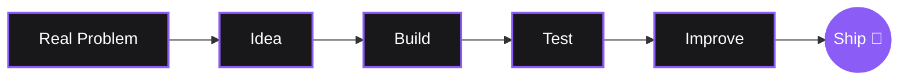

# ⚡ Agnel Francis Olakkengil
**Web Developer @oslohaz_e • Computer Science & Cybersecurity Student**

 

  

  
  

 

---

## 👨‍💻 About Me

I am a passionate web developer and student focused on building modern, practical digital solutions. I enjoy taking an idea from **"this would be useful"** to an actual working project, preferring software that is simple, useful, and privacy-conscious.

* 🔐 Exploring **Cybersecurity, Privacy, & Networking**
* 📱 Building **Android & Web Applications**
* 🐍 Developing with **Python, Kotlin, & Web Technologies**
* 🧠 Experimenting with **AI-assisted development tools**

 

## 🎯 Currently Focusing On
* **Data Structures & Algorithms:** Sharpening problem-solving skills for complex systems.
* **Cybersecurity:** Deep diving into secure networking, ethical hacking, and system vulnerabilities.
* **AI Integration:** Figuring out the best ways to integrate offline Large Language Models (LLMs) into consumer applications.

 

## 🎓 Education

* **Jyothi Engineering College (2026-2029)** — Computer Science Engineering (Cybersecurity)
* **Sarvodayam VHSS Aryampadam (2024-2025)** — B.S Computer Engineering Technology

 

## 🚀 Featured Projects

### [AerisIQ](https://github.com/agnelfranciso) *(Jan 2021 - Present)*
A Free and Open Source (FOSS), privacy-first disaster risk intelligence utility for Android. 
* Queries public warning feeds and parses raw disaster bulletins.
* Combines datasets with live local weather telemetry.
* Processes data securely using an offline Large Language Model (LLM) in the device's sandbox.

### [Bussiler](https://github.com/agnelfranciso) *(Apr 2018 - Jan 2021)*
A lightweight, user-friendly interface for passengers to check transit schedules instantly.
* Digitized manual timetables to improve travel planning.
* Reduced commuter waiting times through instant schedule access.

 

## 🛠️ Tools & Technologies

  

 

## 🧠 My Philosophy

* **Build:** Start with a real problem.
* **Simplify:** Remove unnecessary complexity, friction, and noise.
* **Ship:** A working project teaches more than a perfect, unfinished idea.

 

## 📈 GitHub Analytics

  
  

 

  

 

## 📬 Let's Connect

I'm always open to collaborating on open-source projects, discussing cybersecurity, or just geeking out about tech.

  

 

  <i>Built with curiosity, caffeine, and way too many side projects.</i>

