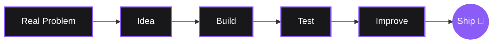

# ⚡ Agnel Francis Olakkengil
**Computer Science & Cybersecurity Student • Junior Software Developer**

 

  

  
  

 

---

## 👨‍💻 About Me

I enjoy taking an idea from **"this would be useful"** to an actual working project. I prefer software that is simple, useful, privacy-conscious, and doesn't require a giant stack to get the job done.

* 🔐 Exploring **Cybersecurity, Privacy, & Networking**
* 📱 Building **Android & Web Applications**
* 🐍 Developing with **Python, Kotlin, & Web Technologies**
* 🧠 Experimenting with **AI-assisted development tools**

 

## 🛠️ Tools & Technologies

  

 

## 🚀 My Philosophy

* **Build:** Start with a real problem.
* **Simplify:** Remove unnecessary complexity, friction, and noise.
* **Ship:** A working project teaches more than a perfect, unfinished idea.

 

## 📈 GitHub Analytics

  
  

 

  <i>Built with curiosity, caffeine, and way too many side projects.</i>

