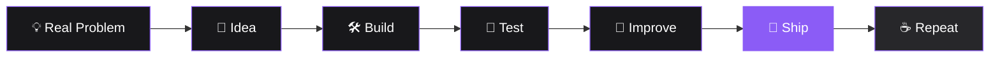

<div align="center">

# ⚡ Agnel Francis Olakkengil

### `Web Developer @oslohaz_e` · `CSE Cybersecurity Student` · `Builder of Random Ideas`

<p>
  
</p>

<p>
  <a href="https://github.com/agnelfranciso">
    
  </a>
  <a href="https://github.com/agnelfrancis">
    
  </a>
  <a href="mailto:agnelfrancis2007@gmail.com">
    
  </a>
</p>

<p>
  
  
</p>

</div>

---

## 👨‍💻 About Me

I'm a **web developer and Computer Science student** focused on building modern, practical digital solutions.

I like taking an idea from:

> **"this would be useful" → "wait... I can actually build this."**

My preference is simple: software should be **useful, understandable, privacy-conscious, and actually shippable.**

* 🔐 Exploring **Cybersecurity, Privacy & Networking**
* 📱 Building **Android & Web Applications**
* 🐍 Developing with **Python, Kotlin & Web Technologies**
* 🧠 Experimenting with **AI-assisted development**
* 🛠️ Turning random ideas into surprisingly real projects
* 🧪 Breaking things intentionally so I can understand why they broke

---

## 🎯 Currently Focusing On

| Area                   | What I'm doing                                                       |
| ---------------------- | -------------------------------------------------------------------- |
| 🧩 **DSA**             | Sharpening problem-solving and algorithmic thinking                  |
| 🔐 **Cybersecurity**   | Learning secure networking, ethical hacking & system vulnerabilities |
| 🤖 **AI Integration**  | Exploring offline LLMs inside consumer applications                  |
| 📱 **Android**         | Building privacy-first utilities and practical apps                  |
| 🌐 **Web Development** | Creating clean, functional web experiences                           |

---

## 🎓 Education

### 🎓 Jyothi Engineering College

**2026 – 2029** · Computer Science Engineering — Cybersecurity

### 💻 Sarvodayam VHSS Aryampadam

**2024 – 2025** · Junior Software Developer

---

# 🚀 Featured Projects

## 🌦️ AerisIQ

**Privacy-first disaster risk intelligence for Android**

A Free and Open Source (FOSS) utility designed to turn scattered public safety information into useful local intelligence.

* 🌐 Queries public warning feeds and parses raw disaster bulletins
* 🌦️ Combines datasets with live local weather telemetry
* 🤖 Processes information using an **offline Large Language Model**
* 🔒 Designed around privacy-first, on-device processing
* 📱 Built for practical disaster-awareness use cases

> **Meteorological Intelligence — without handing your data to a server.**

---

## 🚌 Bussiler

**A lightweight transit information interface**

A project focused on making public transportation information easier to access.

* 🗓️ Digitized manual timetables
* ⚡ Provides instant schedule access
* 🚏 Helps passengers plan journeys more efficiently
* 🧠 Focused on reducing unnecessary waiting and information friction

> Sometimes the best software is just a boring problem solved properly.

---

# 🧰 Tech Stack

<div align="center">

### Languages


### Tools & Platforms


</div>

---

# 🧠 How I Build



### My rules:

**Build** — Start with a real problem.
**Simplify** — Remove unnecessary complexity, friction and noise.
**Test** — Assume something will break. It probably will.
**Improve** — Make the next version better than the last.
**Ship** — A working project teaches more than a perfect unfinished idea.

---

# 📊 GitHub Analytics

<div align="center">

<a href="https://github.com/agnelfranciso">


</a>

<br><br>


</div>

> **Note:** GitHub's contribution graph and third-party cards can use different calculation/caching rules, so small differences between cards and GitHub itself are possible.

---

# 🕰️ The GitHub Lore

Before **`agnelfranciso`**, there was...

### `agnelfrancis`

The old account.

Password?

**Gone.**

Projects?

**Still part of the lore.**

So if you ever find suspiciously ancient code associated with `agnelfrancis`...

> *Yes. That's probably me.*

---

# 🧪 Developer Status

```text
┌──────────────────────────────────────────────┐
│                 AGNEL.EXE                    │
├──────────────────────────────────────────────┤
│ Status        : Building                     │
│ Main Quest    : Cybersecurity + Software     │
│ Side Quest    : Too many project ideas       │
│ Current Buff  : Curiosity                    │
│ Weakness      : "One more feature"           │
│ Runtime       : ☕ + 🎧 + VS Code             │
│ Bugs          : Features waiting for names   │
│ Deployment    : Eventually™                  │
└──────────────────────────────────────────────┘
```

---

# 🧩 Random Facts

* 🧠 I like understanding **how things work**, not just using them.
* 🔐 Privacy isn't an afterthought in the projects I build.
* 🛠️ I prefer shipping something useful over endlessly polishing an idea.
* 💡 A random thought can become a GitHub repository way too quickly.
* 🐛 Every developer has bugs. Mine occasionally come with features.
* 🚀 The goal isn't to build everything. It's to keep building.

---

# 📌 Philosophy

> **"Ideas are cheap. Building them isn't."**

I believe the best way to learn software development is to **build things that didn't exist before**.

Not every project needs to become a startup.

Not every experiment needs to be perfect.

Sometimes you just need to open the editor and start.

---

# 📬 Let's Connect

I'm always open to collaborating on open-source projects, discussing cybersecurity, experimenting with new technologies, or just geeking out about tech.

<div align="center">

<a href="mailto:agnelfrancis2007@gmail.com">

</a>

<a href="https://github.com/agnelfranciso">

</a>

</div>

<br>

<div align="center">

### `Built with curiosity, caffeine, and way too many side projects.`

<sub>© Agnel Francis Olakkengil · Still building.</sub>

</div>
